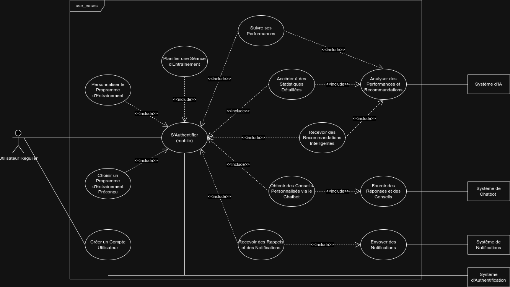
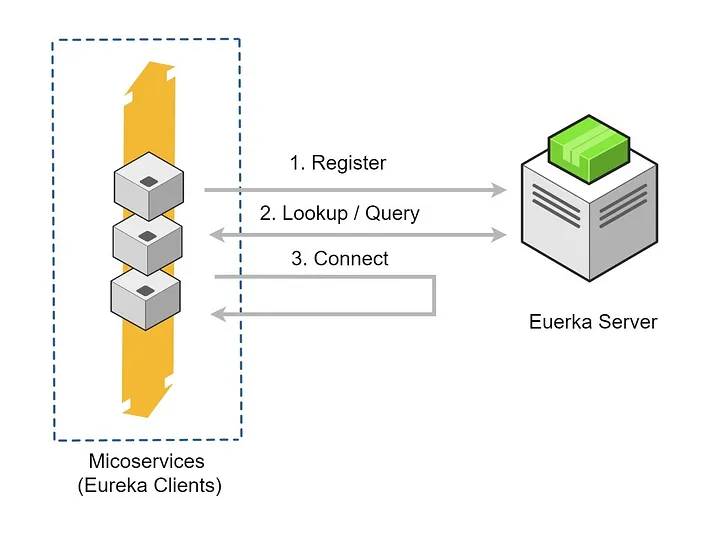

# Titre du Projet :

**Corecraft** : Application de Fitness et de Suivi des Performances

## Membres du Groupes :

* **Hamma Abdessamad**
* **Serroukh Anass**
* **Tarmoune Oussama**
* **Sadgui Salah**

# Introduction

Welcome to our fitness app built on a microservices architecture. Beyond basic workout tracking, our app enables users to plan workouts, track progress, and ask a chat bot about anything fitness related. Our app consists of four core services:

#### User Service:
 This service handles user management and authentication, ensuring a secure and personalized experience for each user.

#### Workout Service:
 Here, users can access a comprehensive database of exercises, enabling them to create customized workout routines tailored to their fitness goals.

#### Plan Service:
 Organize and schedule workouts efficiently with our Plan Service. Users can create, modify, and track workout plans, optimizing their fitness regimen for maximum effectiveness.

#### Stats Service:
 Gain insights into your fitness journey with our Stats Service. Track various statistics, monitor progress over time, and receive personalized recommendations based on your activity.

With our microservices architecture, each service operates independently, allowing for seamless scalability and robust performance. Join our community of fitness enthusiasts and take control of your fitness journey today.

# Table of Contents

- [Titre du Projet :](#titre-du-projet-)
	- [Membres du Groupes :](#membres-du-groupes-)
- [Introduction](#introduction)
			- [User Service:](#user-service)
			- [Workout Service:](#workout-service)
			- [Plan Service:](#plan-service)
			- [Stats Service:](#stats-service)
- [Table of Contents](#table-of-contents)
- [UML Diagrams:](#uml-diagrams)
	- [Use cases diagram:](#use-cases-diagram)
	- [Class diagram:](#class-diagram)
- [Architecture:](#architecture)
	- [Microservice Architecture:](#microservice-architecture)
- [Microservice Components:](#microservice-components)
	- [Postgres DBMS:](#postgres-dbms)
	- [Spring Cloud Gateway (API Gateway)](#spring-cloud-gateway-api-gateway)
	- [Eureka Server](#eureka-server)
		- [Service Registration:](#service-registration)
		- [Service Discovery:](#service-discovery)
		- [Dynamic Scaling:](#dynamic-scaling)
	- [OpenFeign](#openfeign)
		- [Service-to-Service Communication:](#service-to-service-communication)
		- [Ease of Configuration:](#ease-of-configuration)
	- [User Service](#user-service-1)
		- [**Key Features**:](#key-features)
		- [JWT Authentication:](#jwt-authentication)
		- [Password Hashing:](#password-hashing)
		- [Functionalities:](#functionalities)
		- [Why JWT Tokens ?](#why-jwt-tokens-)
	- [Workouts Service](#workouts-service)
		- [Functionalities:](#functionalities-1)
	- [Stats Service](#stats-service-1)
		- [Functionalities :](#functionalities-)
	- [Plan Service](#plan-service-1)
	- [DevOps](#devops)
		- [Key Containerization Aspects:](#key-containerization-aspects)
		- [DevOps Integration:](#devops-integration)

# UML Diagrams: 

## Use cases diagram:
 

## Class diagram:

# Architecture:

## Microservice Architecture:

# Microservice Components:

## Postgres DBMS:

**Why PostgreSQL?**
We chose PostgreSQL for the following reasons:

*Reliability and Stability*: PostgreSQL is known for its robustness and data integrity, making it ideal for managing critical user data.

*Advanced Features*: It offers advanced querying capabilities, full ACID compliance, and powerful indexing, which are essential for our varied and complex data operations.

*Scalability*: PostgreSQL supports high levels of concurrent transactions, making it suitable for the growing demands of our fitness app.

*Open Source*: Being open source, PostgreSQL provides flexibility and a cost-effective solution without compromising on features.

Using separate PostgreSQL databases for each microservice enhances the modularity of our architecture, allowing each service to operate independently and scale according to its specific workload. This approach also simplifies maintenance and improves fault isolation, contributing to the overall resilience and efficiency of the system.

## Spring Cloud Gateway (API Gateway)

An API Gateway acts as a single entry point for all client interactions with a microservices-based application. It handles request routing, composition, and protocol translation, providing a unified interface to the client while hiding the complexities of the underlying microservices architecture.

In our fitness app, the API Gateway `Spring Cloud Gateway`  serves several critical functions:

* ### Unified Access Point

*Function*: Clients interact with the API Gateway instead of directly accessing individual services.  
*Benefit*: Simplifies client-side logic by providing a single endpoint for all requests, reducing the complexity of managing multiple service endpoints.

* ### Request Routing

*Function*: Routes incoming client requests to the appropriate microservice (User Service, Workouts Service, Plan Service, Stats Service, or Chatbot Service).  
*Benefit*: Ensures that each request is directed to the correct service without exposing the service's internal details to the client.

* ### Security

*Function*: Acts as a gateway for enforcing security policies, such as authentication and rate limiting.  
*Benefit*: Protects the backend services from unauthorized access and potential abuse by centralizing security enforcement.

In our app, the API Gateway routes client requests to specific services based on the type of request:

*User-related requests* are directed to the **User Service**.  
*Workout-related requests* go to the **Workouts Service**.  
*Plan-related requests* are handled by the **Plan Service**.  
*Performance tracking requests* are managed by the **Stats Service**.

## Eureka Server 

Eureka Server is a service discovery server used in microservices architecture. It acts as a registry where microservices can register themselves and discover other registered services. This enables dynamic scaling and inter-service communication without hardcoding service endpoints.

In our case, Eureka Server is employed to manage the discovery of microservices, ensuring they can easily find and communicate with each other. Here’s how Eureka Server is utilized in our architecture:

### Service Registration:

Each microservice registers itself with the Eureka Server upon startup. This registration includes the service’s metadata, such as its hostname, port, health status, and other details. By registering with Eureka, services become discoverable by other services in the ecosystem.

### Service Discovery:

Microservices use Eureka to discover the endpoints of other services they need to communicate with. Instead of relying on hardcoded URLs, services query the Eureka Server to find the current addresses of the required services, allowing for more flexible and resilient communication.

### Dynamic Scaling:

Eureka Server supports dynamic scaling by automatically updating its registry as services are added or removed. When a new instance of a microservice is launched, it registers with Eureka, making itself available for discovery. Similarly, when a service instance goes down, Eureka removes it from the registry. This dynamic nature helps in maintaining the availability and scalability of the application.

## OpenFeign

**OpenFeign** is a declarative web service client that simplifies the process of making HTTP requests to external services in a microservices architecture. It allows developers to define and call APIs with minimal boilerplate code, enhancing productivity and maintainability.

In our fitness app, OpenFeign is used for inter-service communication. Each microservice can communicate with others efficiently and reliably without needing to manage the underlying HTTP client details. 
Here’s how OpenFeign is utilized in our architecture:

### Service-to-Service Communication:
OpenFeign enables seamless service-to-service communication by allowing microservices to communicate with each other using simple Java interfaces annotated with HTTP methods and endpoints. This reduces the complexity of making HTTP calls between services, minimizing boilerplate code and potential errors.

### Ease of Configuration:
Configuring OpenFeign is straightforward and can be managed via properties or configuration classes. This simplifies the setup and management of REST clients, allowing for quick adjustments and customization.

## User Service

The User Service is a critical component of our fitness app, responsible for managing user information and authentication. It ensures secure handling of user data and provides endpoints for user registration, login, and profile management.

### **Key Features**:

### JWT Authentication:

The service employs JSON Web Tokens (**JWT**) to authenticate users. When users register or log in, a JWT token is generated and returned to the client. This token is used for authorizing subsequent requests, ensuring secure and stateless communication between the client and the server.

### Password Hashing:

User passwords are hashed using a secure algorithm before being stored in the database. This enhances security by ensuring that plain-text passwords are never stored or transmitted, mitigating the risk of password exposure in case of a database breach.

### Functionalities:

* Ensures new users can sign up securely.
* Authenticates existing users and provides them with a JWT token for secure communication.
* Allows users to access their profile information securely.
* Provides administrative functionality to list all users (if needed).
* Serves as a simple endpoint to confirm successful authentication and access.

### Why JWT Tokens ?

* *Stateless Authentication*: JWT tokens facilitate stateless authentication, which eliminates the need for the server to maintain session information, thereby reducing overhead and improving scalability.

* *Security*: JWT tokens are signed (and optionally encrypted), ensuring that the data they contain cannot be tampered with and remains confidential.

* *Flexibility*: JWT tokens can include user roles and permissions, simplifying the implementation of fine-grained access control and authorization.

## Workouts Service

The Workouts Service is a core component of our fitness app, responsible for managing all aspects of workout routines. It handles creating, retrieving, updating, and deleting workout records, ensuring users have a seamless experience in organizing and tracking their fitness activities.

### Functionalities:

* *Retrieve All Workouts*: Allows users to fetch all workout records available in the system.  
* *Add New Workout*: Enables users to create a new workout entry. The workout is linked to the user who created it, identified through the JWT token.  
* *Filter Workouts by Body Part*: Users can filter workouts based on the body part they target, providing a customized workout experience.  
* *Delete Workout*: Users can delete their workouts, ensuring they have control over their workout data.

## Stats Service
The Stats Service in our fitness app is dedicated to tracking and managing user performance statistics. This service helps users monitor their progress over time, providing valuable insights into their fitness journey.

### Functionalities :

* Users can log and update their workout completion stats, including details like current weight and other performance metrics. 
* The service allows users to retrieve their performance statistics, giving them a comprehensive view of their fitness progress. 

## Plan Service
The Plan Service is a pivotal component of our fitness app, dedicated to managing workout plans. This service allows users to create, update, retrieve, and manage their workout plans, facilitating structured and efficient fitness routines.

Functionalities:
* *Create Plan*: Allows users to create a new workout plan, associating it with their user profile.  
* *Retrieve Plan by ID*: Fetches a specific workout plan using its unique ID.  
* *Update Plan Status*: Enables users to update the status of a workout plan, helping them track their progress and mark plans as complete, in progress, or on hold.  
* *Filter Plans by Status*: Users can filter their workout plans based on their status, allowing them to easily manage and organize their fitness routines.

## DevOps

The project leverages **Docker** for containerization, streamlining the deployment process and ensuring consistency across different environments. Each microservice, along with the PostgreSQL databases, is encapsulated within Docker containers, enabling modular development and deployment. Dockerfiles are provided for each service, specifying the build process and runtime environment configuration.

### Key Containerization Aspects:

* *Isolation*: Docker containers provide lightweight, isolated environments for each microservice, ensuring application stability and preventing conflicts between dependencies.  
* *Portability*: Docker images can be deployed across different platforms and environments with minimal changes, facilitating seamless migration between development, testing, and production environments.
Resource Efficiency: Docker containers share the host OS kernel, optimizing resource utilization and reducing infrastructure costs compared to traditional virtual machines.  
* *Version Control*: Docker images serve as immutable artifacts, capturing the entire application stack and facilitating version control for reproducible deployments.

### DevOps Integration:

* *Docker Compose*: Defines a multi-container environment for orchestrating microservice deployment, specifying dependencies, network configurations, and service discovery.  
* *Custom Initialization Scripts*: Utilizes custom initialization scripts (**create_db.sh**) mounted into database containers to execute custom database setup during initialization, ensuring consistent database configurations.  
* *Dependency Management*: Docker Compose's depends_on directive specifies service dependencies, facilitating integration testing and ensuring proper startup order.  
* *Networking*: Connects services within the Docker Compose environment using a custom bridge network (net), enabling communication between microservices while isolating them from external networks.

