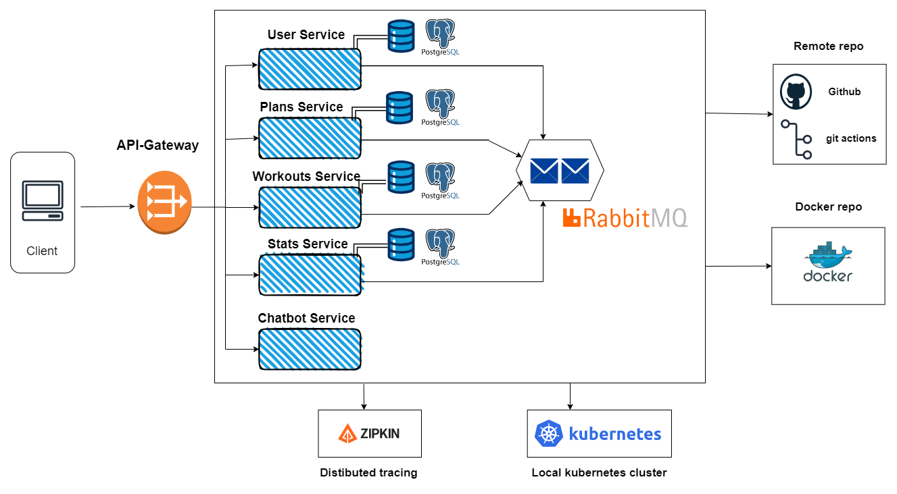

# Titre du Projet :

**Corecraft** : Application de Fitness et de Suivi des Performances

## Membres du Groupes :

* **Hamma Abdessamad**
* **Serroukh Anass**
* **Tarmoune Oussama**
* **Sadgui Salah**

# Introduction

Welcome to our fitness app built on a microservices architecture. Beyond basic workout tracking, our app enables users to plan workouts, track progress, and ask a chat bot about anything fitness related. Our app consists of four core services:

#### User Service:
 This service handles user management and authentication, ensuring a secure and personalized experience for each user.

#### Workout Service:
 Here, users can access a comprehensive database of exercises, enabling them to create customized workout routines tailored to their fitness goals.

#### Plan Service:
 Organize and schedule workouts efficiently with our Plan Service. Users can create, modify, and track workout plans, optimizing their fitness regimen for maximum effectiveness.

#### Stats Service:
 Gain insights into your fitness journey with our Stats Service. Track various statistics, monitor progress over time, and receive personalized recommendations based on your activity.

With our microservices architecture, each service operates independently, allowing for seamless scalability and robust performance. Join our community of fitness enthusiasts and take control of your fitness journey today.

# UML Diagrams: 

## Use cases diagram:
 

## Class diagram:

# Architecture:

## Microservice Architecture:

# Microservice Components:

## Postgres DBMS:

**Why PostgreSQL?**
We chose PostgreSQL for the following reasons:

*Reliability and Stability*: PostgreSQL is known for its robustness and data integrity, making it ideal for managing critical user data.

*Advanced Features*: It offers advanced querying capabilities, full ACID compliance, and powerful indexing, which are essential for our varied and complex data operations.

*Scalability*: PostgreSQL supports high levels of concurrent transactions, making it suitable for the growing demands of our fitness app.

*Open Source*: Being open source, PostgreSQL provides flexibility and a cost-effective solution without compromising on features.

Using separate PostgreSQL databases for each microservice enhances the modularity of our architecture, allowing each service to operate independently and scale according to its specific workload. This approach also simplifies maintenance and improves fault isolation, contributing to the overall resilience and efficiency of the system.

## Spring Cloud Gateway (API Gateway)

An API Gateway acts as a single entry point for all client interactions with a microservices-based application. It handles request routing, composition, and protocol translation, providing a unified interface to the client while hiding the complexities of the underlying microservices architecture.

In our fitness app, the API Gateway `Spring Cloud Gateway`  serves several critical functions:

* ### Unified Access Point

*Function*: Clients interact with the API Gateway instead of directly accessing individual services.  
*Benefit*: Simplifies client-side logic by providing a single endpoint for all requests, reducing the complexity of managing multiple service endpoints.

* ### Request Routing

*Function*: Routes incoming client requests to the appropriate microservice (User Service, Workouts Service, Plan Service, Stats Service, or Chatbot Service).  
*Benefit*: Ensures that each request is directed to the correct service without exposing the service's internal details to the client.

* ### Security

*Function*: Acts as a gateway for enforcing security policies, such as authentication and rate limiting.  
*Benefit*: Protects the backend services from unauthorized access and potential abuse by centralizing security enforcement.

In our app, the API Gateway routes client requests to specific services based on the type of request:

*User-related requests* are directed to the **User Service**.  
*Workout-related requests* go to the **Workouts Service**.  
*Plan-related requests* are handled by the **Plan Service**.  
*Performance tracking requests* are managed by the **Stats Service**.

## Eureka Server 

Eureka Server is a service discovery server used in microservices architecture. It acts as a registry where microservices can register themselves and discover other registered services. This enables dynamic scaling and inter-service communication without hardcoding service endpoints.

In our case, Eureka Server is employed to manage the discovery of microservices, ensuring they can easily find and communicate with each other. Here’s how Eureka Server is utilized in our architecture:

### Service Registration:

Each microservice registers itself with the Eureka Server upon startup. This registration includes the service’s metadata, such as its hostname, port, health status, and other details. By registering with Eureka, services become discoverable by other services in the ecosystem.

### Service Discovery:

Microservices use Eureka to discover the endpoints of other services they need to communicate with. Instead of relying on hardcoded URLs, services query the Eureka Server to find the current addresses of the required services, allowing for more flexible and resilient communication.

### Dynamic Scaling:

Eureka Server supports dynamic scaling by automatically updating its registry as services are added or removed. When a new instance of a microservice is launched, it registers with Eureka, making itself available for discovery. Similarly, when a service instance goes down, Eureka removes it from the registry. This dynamic nature helps in maintaining the availability and scalability of the application.

## OpenFeign

**OpenFeign** is a declarative web service client that simplifies the process of making HTTP requests to external services in a microservices architecture. It allows developers to define and call APIs with minimal boilerplate code, enhancing productivity and maintainability.

In our fitness app, OpenFeign is used for inter-service communication. Each microservice can communicate with others efficiently and reliably without needing to manage the underlying HTTP client details. 
Here’s how OpenFeign is utilized in our architecture:

### Service-to-Service Communication:
OpenFeign enables seamless service-to-service communication by allowing microservices to communicate with each other using simple Java interfaces annotated with HTTP methods and endpoints. This reduces the complexity of making HTTP calls between services, minimizing boilerplate code and potential errors.

### Ease of Configuration:
Configuring OpenFeign is straightforward and can be managed via properties or configuration classes. This simplifies the setup and management of REST clients, allowing for quick adjustments and customization.

## User Service

The User Service is a critical component of our fitness app, responsible for managing user information and authentication. It ensures secure handling of user data and provides endpoints for user registration, login, and profile management.

*Key Features*:

### JWT Authentication:

The service employs JSON Web Tokens (JWT) to authenticate users. When users register or log in, a JWT token is generated and returned to the client. This token is used for authorizing subsequent requests, ensuring secure and stateless communication between the client and the server.

### Password Hashing:

User passwords are hashed using a secure algorithm before being stored in the database. This enhances security by ensuring that plain-text passwords are never stored or transmitted, mitigating the risk of password exposure in case of a database breach.

